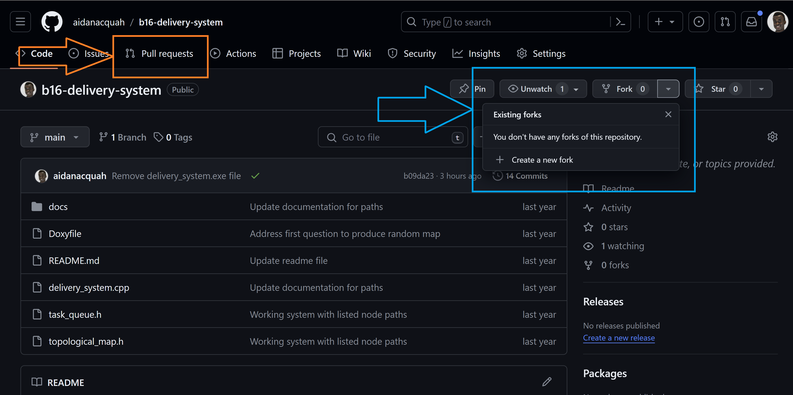

# Robot delivery system in C++

This repository for answering question 6 of B16 tutorial problem sheet 2.

The most up to date version of this repository is available at <https://github.com/aidanacquah/b16-delivery-system.git>. This should take you to a Github page as shown in the image below.

This has been produced by Aidan Acquah, who can be contacted [here](mailto:aidan.acquah@eng.ox.ac.uk).

The documentation for this repository can be found at <https://aidanacquah.github.io/b16-delivery-system>.

Note that documentation is produced by [doxygen](https://github.com/doxygen/doxygen).

The logo used was produced by [DALL·E mini by craiyon.com](https://www.craiyon.com/).

Some parts of this code have been generated or inspired by ChatGPT, which is available [here](https://chat.openai.com/).

## Alternate to B16 Tutorial 2 Question 6

### Pre-requisites

To be able to carry out this alternative set of questions for the tutorial, you must first:

* Have a GitHub account. Click the link to [sign up to GitHub](https://github.com/signup).
* Have git downloaded and installed on your local machine. Click the link to [download git](https://git-scm.com/downloads).
Make sure to install once the file is downloaded.

* Navigate to the base [GitHub repository](https://github.com/aidanacquah/b16-delivery-system.git), and select the option to create a new fork.
This will create your own personal version of this public repository.
Click the buttons indicated with the [blue outline](#github-repo-image).

* Git clone your forked version of the repository.
This should generally be done using the following steps:
  * **[For Windows users]**: In your projects folder, right click  
    and select the option "Git Bash Here". This should open a command line console.

    **[For Mac users]**: Navigate to projects folder, right click and select "New Terminal at Folder" under the Services option. If you cannot see this, follow the instructions at <https://www.youtube.com/watch?v=7BSEGuFov-Y>.

  * In the console/terminal, enter:
    <pre>git clone https://github.com/{your_github_username}/b16-delivery-system.git</pre>
    Make sure to replace `{your_github_username}`.

  * Set up git credentials for making changes. Run the commands:
    <pre>git config --global user.email "{user@email.com}"
    git config --global user.name "{User Name}"</pre>
    Make sure to replace `{user@email.com}` and `{User Name}`.

  * Open the cloned repository folder in Visual studio code (or   your preferred IDE).

### Tutorial Questions

**a)** Go through the `delivery_system.cpp`, `task_queue.h` and `topological_map.h` files to try to understand the purpose of the existing code. Ensure the code runs as expected and try to interpret the meaning of the outputs.

**b)** Can you list 3 improvements that could be made to the existing code. This could be to produce a better solution for the tutorial question, improvements in formatting, structuring or comments of the code.

**c)** Can you try to address once of these improvements, push your changes and submit a pull request to the main repository?

After making the changes to the code, this needs to be saved in the remote github repository. We can do this either using Visual Studio codes Source Control, or using command line git bash.

Using command line:

  1. Save all files with changes made.
  1. Stage the changes made. Run: <pre>git add {name_of_file}</pre> for each `{name_of_file}` that has been changed.
  1. Commit the stages changes. Run: <pre>git commit -m "{Some message}"</pre>replacing `{Some message}` with appropriate text reflecting changes made.
  1. Push changes to the remote repository. Run: <pre>git push origin main</pre>

Using Visual Studio Code Source Control:

  1. Save all files with changes made.
  1. Open the source control panel, by selecting the third icon down in the leftmost panel or pressing `Ctrl + Shift + G`
  1. For each file with changes listed, right click and select `Stage Changes`
  1. Enter an appropriate message in the message box, and click the `Commit & Push` button.
  If you see the Commit button, select the dropdown beside the button and select `Commit & Push`.

After completing these steps, you have successfully pushed your new updates to the live version your forked repository.
However, we wish to also request to make changes to the base repository.

To do so, select the pull requests tab seen in the [repository page](https://github.com/aidanacquah/b16-delivery-system.git) indicated with the [orange outline](#github-repo-image). Fill out all appropriate details and submit the pull request.
